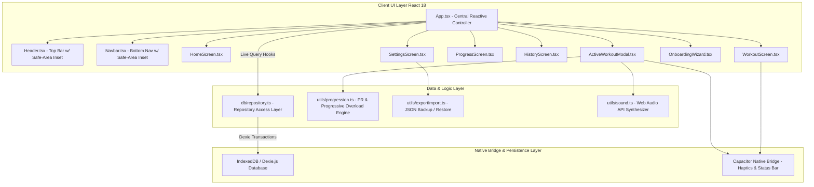
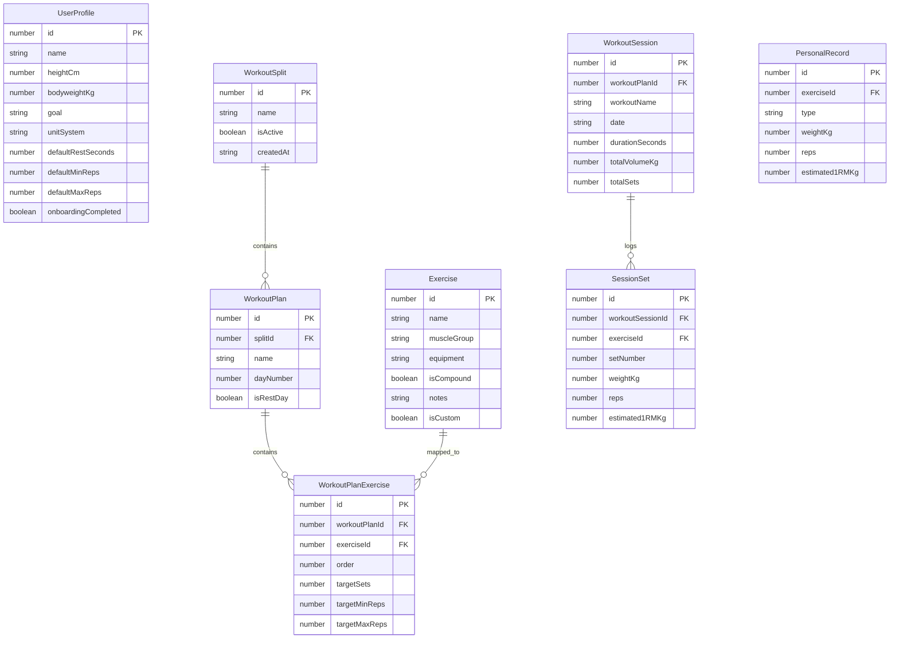

# GymOverloader — Comprehensive Architectural Audit

## 1. Executive Summary & Architecture Overview

**GymOverloader** is a high-performance, offline-first native mobile and web application built for scientific strength training and progressive overload tracking. The system is designed around a **Local-First Architecture**, ensuring 100% data privacy, instant UI response times, and full offline capability without requiring any server infrastructure.

### Technology Stack Matrix
| Layer | Technologies Used |
| :--- | :--- |
| **Frontend Framework** | React 18, TypeScript, Vite |
| **Styling & UI Design** | TailwindCSS v4, Vanilla CSS Design System, Lucide React Icons |
| **Data Visualization** | Recharts (Responsive Line & Bar Charts) |
| **Database & Persistence** | IndexedDB via Dexie.js (`dexie-react-hooks` for reactive queries) |
| **Native Mobile Runtime** | Capacitor 7 (Android / iOS native bridge) |
| **Hardware APIs** | `@capacitor/haptics`, `@capacitor/status-bar`, Web Audio API |

---

## 2. System Architecture Diagram

---

## 3. Database Schema & Data Models Audit

The database is built on top of **Dexie.js** (`db/db.ts`). It utilizes schema Versioning to handle database evolution seamlessly.

### Entity Relationship & Schema Details

---

## 4. Calculation & Progression Logic Engines

### A. Dual PR Tracking Engine (`utils/progression.ts`)
The application enforces **two distinct PR types** for every exercise, replacing inaccurate total-volume metrics:
1. **1-Rep Max PR (`1rm`)**: Tracks highest actual weight successfully lifted for 1 single rep. Calculated from actual single-rep set logs (`reps === 1`).
2. **Best Weight × Reps PR (`best_set`)**: Tracks performance as a combination of weight lifted and reps achieved, using the **Epley 1RM Formula**:
   $$\text{Estimated 1RM} = \text{Weight (kg)} \times \left(1 + \frac{\text{Reps}}{30}\right)$$

### B. Session vs. Session Progressive Overload Calculation Engine
When comparing a session against previous workout history, the progression engine calculates:
$$\Delta \text{Volume} = \text{Volume}_{\text{current}} - \text{Volume}_{\text{previous}}$$
$$\Delta \% = \left(\frac{\text{Volume}_{\text{current}} - \text{Volume}_{\text{previous}}}{\text{Volume}_{\text{previous}}}\right) \times 100$$
It evaluates status flags:
- **Improved**: Volume increase $\ge 2\%$ or new PR achieved.
- **Maintained**: Volume within $\pm 2\%$.
- **Decreased**: Volume reduction $> 2\%$.

### C. Smart Target Suggestion Engine
Before each set, the algorithm analyzes historical performance and generates real-time advice:
- If target rep range upper limit was reached in previous session $\rightarrow$ **Suggest $+2.5 \text{ kg}$ weight increase**.
- If target rep range was missed $\rightarrow$ **Suggest maintaining weight and adding reps**.

---

## 5. UI Architecture & Responsive Mobile Design Audit

### A. View & Component Structure
- **`Header.tsx`**: Top header with dynamic `calc(env(safe-area-inset-top, 24px) + 10px)` clearance, ensuring zero overlap with mobile status bars across any device.
- **`Navbar.tsx`**: Floating bottom navigation dock featuring backdrop blur and `env(safe-area-inset-bottom)` safe-area padding.
- **`WorkoutScreen.tsx`**: Main routine editor supporting:
  - Day cloning (Copy & Paste day workout).
  - Bulk day clearing (Delete All Days & rebuild from zero).
  - Custom Exercise Creation & In-line Exercise Details Editor.
- **`ActiveWorkoutModal.tsx`**: Execution screen with real-time floating timer, rest timer audio alerts, haptic set-completion feedback, and live PR celebration toasts.
- **`HomeScreen.tsx`**: Dashboard showcasing streak counters, today's workout plan, volume breakdowns by muscle group, and quick session starters.
- **`ProgressScreen.tsx`**: Interactive charts (Recharts) displaying 1RM strength curves over time and muscle volume distribution.
- **`HistoryScreen.tsx`**: Log history with detailed set breakdowns.
- **`SettingsScreen.tsx`**: Unit system toggle (Kg / Lb), full JSON data backup/restore, and database reset.

---

## 6. Mobile Native & Build Pipeline Audit

- **Capacitor Integration**: Native Android target configured in `android/` with Java 17 toolchain compatibility.
- **Haptic Engine (`utils/native.ts`)**: Triggers physical vibration on tab navigation, set completion, and PR achievements with automatic web browser fallback.
- **Build Pipeline**:
  - `npm run build`: Compiles TypeScript and runs Vite production bundler.
  - `npm run build:mobile`: Executes web build and syncs assets into Android native project (`npx cap sync`).
  - `./gradlew assembleDebug`: Assembles production-ready Android APK (`app-debug.apk`).

---

## 7. Audit Rating & Key Strengths

| Category | Rating | Remarks |
| :--- | :--- | :--- |
| **Architecture & Code Quality** | ⭐⭐⭐⭐⭐ (5/5) | Clean separation of UI, repository, progression logic, and native hardware. |
| **Data Integrity & Offline Capabilities** | ⭐⭐⭐⭐⭐ (5/5) | Dexie IndexedDB transactions ensure offline safety and zero data loss. |
| **Scientific Progression Logic** | ⭐⭐⭐⭐⭐ (5/5) | Dual PR system and Epley 1RM formula strictly adhere to exercise science. |
| **Mobile Responsiveness & UX** | ⭐⭐⭐⭐⭐ (5/5) | Full safe-area inset support, haptics, dark/light sleek aesthetics, and touch-friendly controls. |
| **Compilation & Build Health** | ⭐⭐⭐⭐⭐ (5/5) | Clean build pipeline producing standalone APKs with zero build warnings. |
